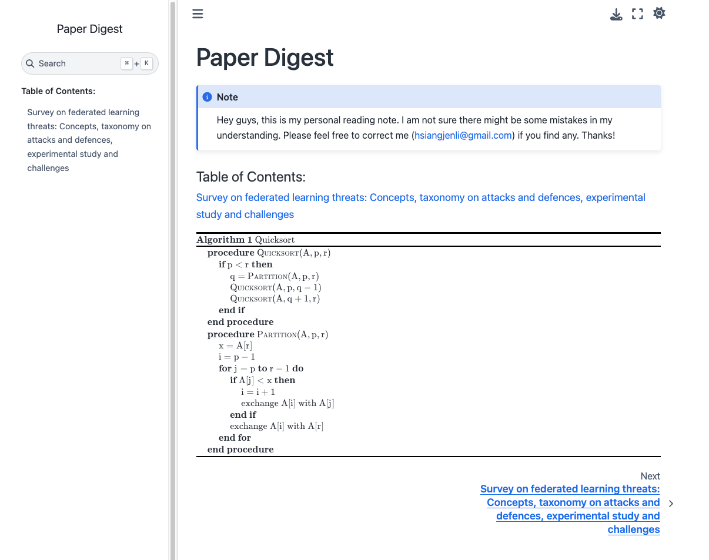

# academic-reading-template

Here’s an academic reading notes template built using Sphinx and reStructuredText, along with extensions like BibTeX and pseudocode to simplify writing scholarly notes. You can view a live demo here. This template also includes a Dockerfile for easy building and deployment with Docker.

> 
